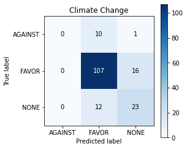

# Introduction 
This task is for predicting stance towards a given target(**Atheism**, **Climate Change**, **Feminist Movement**, **Abortion**, or **Hilary Clinton**) based on the corresponding Tweet.

## Stance Prediction VS Sentiment analysis 
- Sentiment analysis aims at inferring the general opinion (positive, negative or neutral) towards a piece of text. 
- Stance prediction aims at predicting the opinion towards a given target of interest based on a piece of text. 
### Stance prediction is tricky
It's very common that the target of interest is not mentioned in the tweet but it does express an opinion towards the given target by referring to the relevant topics. 
- Target: **Donald Trump** 
- Tweet: *Jeb Bush is the only sane candidate in this republican lineup.*
- Stance: In this tweet, **Donald Trump** is not mentioned, but the opinion towards **Jeb Bush** expressed in the tweet helps deduce that this tweet is highly likely to be against **Donald Trump**. 

In order to make the model generalize better, in data collection, a large amount of tweets that express an opinion towards the target of interest without explicitly mentioning it by name were picked.[1]

# Literature review 
For this task, the CNN + BiLSTM architecture I experimented is based on a Multi- Kernel Convolution and Attentive LSTM Variants model proposed by SIDDIQUA et al[2]. The proposed model combine the attention based densely connected Bi-LSTM and nested LSTM with multi- kernel convolution. In order to tackle the problem that sometimes target is not included in the tweet, as input, the corresponding target is appended with the Tweet. Multi-kernel convolution filters extract features from the word embedding before feeding it to the densely connected Bi-LSTM and nested LSTMs. Different size of kernel [2,3,4,5] extracts features in groups of sequential [2,3,4,5] words at a time. Densely connected Bi- LSTM and nested LSTMs are for handling overfitting, vanishing gradient and long-term independency, which are common in RNN. The attention mechanism helps pay attention to the important part of the hidden state sequences. 

For evaluation metric, **F1 score** was used. For the loss function, **cross-entropy** was used. For optimizer, **Adam** was applied.

In terms of data augmentation, Vosoughi et all[3] applied the synonym based replacement technique introduced by Zhang et al [4]. The only difference is that instead of thesaurus, they used Word2Vec, with the intuition that Word2Vec covers more phrases regarding the targets.

# Explore the data
In terms of data distribution in stance, the ratio among **AGAINST**, **FAVOR** and **NONE** is 2:1:1, which is not too bad, but the model has the potential to skew to the dominant class. In that case, even if the model has good performance, it doesn't necessarily represent the 3 classes equally or generate well in real life. Therefore, normalised class weights is applied.  
   
In this task, besides the overall performance, we're also interested in the performance in each individual target. The distribution among the 5 targets are not perfectly evenly distributed, but in general it's not too bad.  
   
Similarly, we also look at the stance distribution within each individual target. The distribution in general skews to AGAINST, roughly AGAINST : FAVOUR : NONE = 2:1:1, except for 'Climate Change is a Real Concern' with much fewer data points for AGAINST than FAVOR or NONE.  

# Split the data
In order to make the model performance in validation set represents not only each individual target, but also each stance within each target. Validation set includes 40 sampled data points out of each Stance within each Target, except for 'AGAINST' in 'Climate Change', which doesn't contain enough data points, so 40% out of 'Climate Change - AGAINST' was sampled. In total, it makes up around 20% of the training set.  
 

# Pre-process the data
In this task, stance prediction involves 2 inputs, which are tweets and targets. In order to include both as input, target is appended with tweet for the embedding layer. 
## Text pre-processing 
- Trimming the target to make it sound neutral, because some targets contains sentiments which might confuse the model. For example, **'Climate change is a real concern'**, the target itself shouldn't have but already expressed a very clear stance towards climate change. After trimming, it's **'Climate Change'**, which is neutral.
- Tokenizing words in a tweet into individual tokens for word embedding. Arabic numbers are converted into words, such as 3 to three, as '3' is not included in GloVe. 
- Tokens without meaning such as **punctuations**, **stop-words** and **non-alphabetic characters** except for **#** are removed. The reason why we keep # is that # is has meaning in Tweet, and GloVe Tweet embedding can recognise #. Case is maintained sensitive in this task, as words written in upper case conveys sentiment, such as anger and surprise.

# Data Augmentation
A word embedding (GloVe) synonym based approach is applied. For every tweet in the training set, the sentence is augmented by substituting some words with synonyms in the GloVe context. With text augmentation, the number of training dataset is doubled. Text augmentation is not applied in the validation set, as text augmentation doesn't necessarily improve the performance, and we want to find out whether it's actually helpful.

# Why Bi-directional LSTM
In handling time-series data, such as a sequence of words, RNN suffers from short- term memory which is due to vanishing gradient during back propagation. Layers from the beginning of the neural network with small gradients stop learning. LSTM solves the problem with a mechanism called gate that can regulate the flow of information, making
sure that the important information is kept and unimportant information is thrown away. Bi- directional LSTM allows the network to make decision based on both past and future information.

# Class weights
The normalized class weights is calculated based on the distribution ratio between AGAINST, FAVOR and NONE. A higher weight is assigned to the minorities (FAVOR and NONE), so that they have more importance during training and prevent the model performance from skewing to AGAINST.

# Picking the loss function
Categorical Cross-entropy is the most commonly used loss function for multi-class classification problem.

# Picking the evaluation metric
For classification problem, *precision* is preferred when the cost of false positive is high, and *recall* is preferred when the cost of false negative is high [5]. *F1 score* is the harmonic mean of precision and recall, which gives a good balance between the two. Our dataset is not evenly distributed, so accuracy is not reliable in this case. It can achieve a high accuracy by simply predicting the majority class. Additionally, in stance detection, both precision and recall are important, so F1 score is picked.

# Word Embedding
Word embedding is used to map each token/word into a matrix of real number, which makes it possible for the neural network to process. In this task, pre-trained word embedding, GloVe- Twitter, is applied, because it's trained on massive amount of Tweets. It matches the purpose of this task, stance prediction on Tweets.

# Learning rate scheduler
Gradually reducing the learning rate is beneficial to training the model as a large learning rate at the beginning speeds up the learning process and a gradually reduced learning rate prevents oscillation.

# Regularisation techniques
In the training process, in order to prevent overfitting, some regularisation techniques are applied, such as Dropout and early stopping.
- Early stopping: A technique to avoid overfitting by stopping the training process when the validation loss doesn't get better, which also helps save time.
- Dropout: One of the most effective regularisation technique, it drops some connections among perceptrons so that the neural network can avoid depending on some particular perceptrons.
- Recurrent Dropout: Recurrent dropout drops the connections between the recurrent units inside LSTM layer.

# Training the model
There are 4 parts in training, which are LSTM, CNN+LSTM, Transformer and LSTM with augmented data. The baseline model is model_a, containing one Bidirectional LSTM layer (units=32, dropout=0.25,recurrent_dropout=0.25).

## Part 1
**model_a** has overfitting with training f1 around 0.7 and validation f1 about o.31. In order to reduce overfitting, in model_b, the complexity of the model is reduced by lowering the number of units in LSTM (from 32 to 15), both dropout and recurrent dropout rate are increased to 0.3.

**In model_b**, the word embedding layer is made trainable with a low learning rate. Despite a higher dropout rate, overfitting increased and the overall performance dropped.

In **model_c**, embedding layer is made non-trainable again. Another LSTM layer is added to see if it helps improve the performance. Based on the validation f1 score, the performance of model_c improved (from 0.32 to 0.35), so one more LSTM layer is added to see how it affects the performance.

In **model_d**, with 3 bi-directional LSTM, it turned out that the performance stays the same, we might as well stick with model_c.

In **model_e**, a fully connected layer is added based on model_c. Based on f1 score, there is tendency of a worse overfitting as the training f1 goes up while the validation f1 stays roughly the same. Therefore, for the first part of training, model_c is the best.

## Part 2
In CNN + LSTM section, multi-kernel convolution is applied. A list of different number of filters [2,3,4] extracts features 2, 3 and 4 respectively at a time. The results from the 3 convolution layers are concatenated before being fed to the bi-directional layer. The first model **model_CNN_a** has bad overfitting, with training f1 going down but validation f1 going up.
In order to reduce overfitting, dropout rate was increased, number of filters in each Conv1D and number of LSTM units were reduced in **model_CNN_b**. It turned out that with regularisation and reduced model complexity, overfitting is effectively reduced, however, the performance is still way worse than any original LSTM model. Thus model_c is still the best model.

## Part 3
In **transformerA**, the validation F1 score is similar to model_c, but the loss is a higher and overfitting is bad.
In **transformerB**, with a higher dropout rate, overfitting is slightly reduced and the performance stays roughly the same. Thus model_c is still the best model.

## Part 4
In the last part of training, augmented data was included in the training set. The architecture of **model_c_AUG** is the same as model_c. The performance turned out to be much worse than that of model_c, validation f1 score dropped from 0.35 to 0.25. It shows that the text augmentation actually hurt the model. In the future, I would like to explore different types of text augmentation techniques. Therefore, **model_c** is picked as the best model.

# Evaluation on test dataset
We look at the confusion matrix and accuracy on each Stance within an individual Target.  
  
For '**Atheism**', it performs well on AGAINST, worst on FAVOR. 43% of FAVOR is predicted as AGAINST.  

  
For '**Climate Change**’, FAVOR performs the best and AGAINST performs worst, and 10 out of AGAINST instances are predicted to be FAVOR.  

   
For '**Feminist Movement**', FAVOR performs the best and AGAINST performs the worst. More than half of AGAINST instances are predicted to be FAVOR.  

  
For '**Hilary Clinton**', None performs the best, with an accuracy of 0.82, AGAINST performs the worst, it has only an accuracy of 0.51 and 30% of 'AGAINST' are predicted to be NONE.  

  
For '**Abortion**', 'None' has an accuracy of 0.68, 'AGAINST' has an accuracy of 0.53. 32% of 'AGAINST' are predicted to be 'NONE'.  

# Independent evaluation
For independent evaluation, 30 tricky tweets, 2 for each stance in each individual target, were collected. Even though part of the Tweets mentioned the targets by its names, it's still quite difficult to deduce the stance. The evaluation result shows that the model (model_c) doesn't do well in real life data.

# Reference
[1]Mohammad, S., Kiritchenko, S., Sobhani, P., Zhu, X. and Cherry, C., 2016. SemEval-2016 Task 6: Detecting Stance in Tweets. Proceedings of the 10th International Workshop on Semantic Evaluation (SemEval-2016),.

[2]SIDDIQUA, Umme Aymun, CHY, Abu Nowshed, and AONO, Masaki. "Tweet Stance Detection Using Multi-Kernel Convolution and Attentive LSTM Variants." IEICE Transactions on Information and Systems E102.D.12 (2019): 2493-503. Web.

[3]Vijayaraghavan, Prashanth, Sysoev, Ivan, Vosoughi, Soroush, and Roy, Deb. "DeepStance at SemEval-2016 Task 6: Detecting Stance in Tweets Using Character and Word-Level CNNs." (2016). Web.

[4]Zhang, Xiang, and LeCun, Yann. "Text Understanding from Scratch." (2015). Web. 

[5]https://medium.com/analytics-vidhya/accuracy-vs-f1-score-6258237beca2

